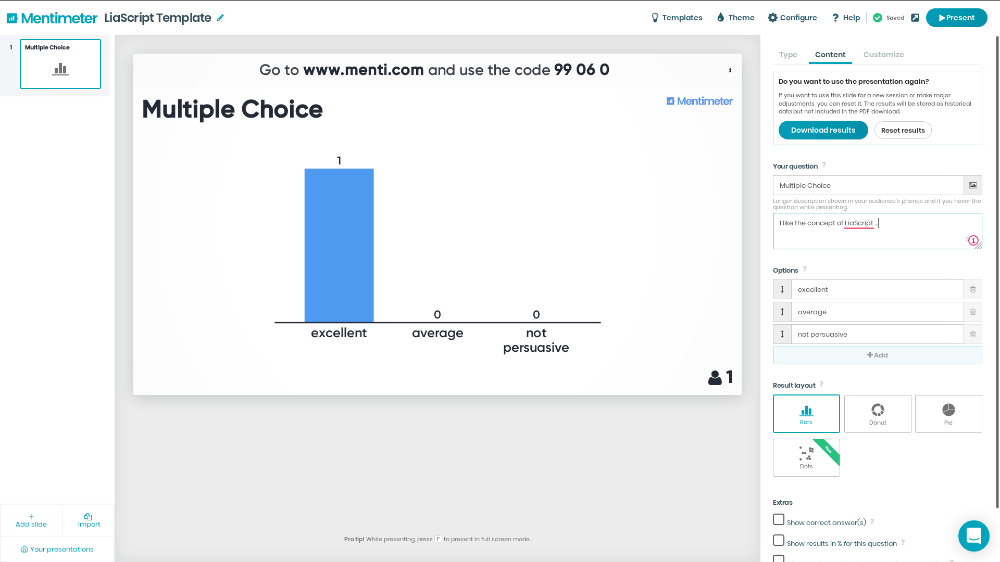

<!--

author:   Sebastian Zug & Georg Jäger
email:    sebastian.zug@informatik.tu-freiberg.de & Georg.Jaeger@informatik.tu-freiberg.de
version:  0.0.1
language: de
narrator: Deutsch Female

-->

# Mentimeter

An interactive version of this example is available on [Link](https://liascript.github.io/course/?https://raw.githubusercontent.com/liaScript/Mentimeter_example/master/mentimeter.md#1)

Mentimeter is a Swedish company that develops and maintains an app used to create presentations with real-time feedback. Users can be invited to participate in surveys, discussions or common votes. The lecturer designs embeds the interactive format in web based presentation slides including a unique number identifying the specific course.
The following image depicts the environment.

<!-- width="100%" -->

Take a view on

+ companies website [Link](https://www.mentimeter.com/)
+ a team blog with advices and tips [Link](https://help.mentimeter.com/en/)

for further information.

In order to integrate a Menimeter-Presentation in your LiaScript-Course you have to
should include the corresponding qrcode and the iframe link. Both are available
in the editing mode of a presentation by opening `configure` -> `share and export`.  

# Example

For participation you can scan the following code. Mentimeter closes each survey after a maximum of 7 days. Hence, your are probably not able to participate any more, but the results are still accessible.

> Question: I my opinion, the concept of LiaScript is ...  

You have 3 different methods to access the voting plattform:

| URL                      | ID only for the App   | QRcode                                                       |
| ------------------------ | ----- | ------------------------------------------------------------ |
| [https://www.menti.com/xqith2m736](https://www.menti.com/xqith2m736) | 99060 | <!-- width="30%"--> |

The result is presented in the following way:

<iframe sandbox='allow-scripts allow-same-origin allow-presentation' allowfullscreen='true' allowtransparency='true' frameborder='0' height='315' src='https://www.mentimeter.com/embed/97a1c20ef59000d4114915abfc6cc6fa/68c3a63c1c4c' style='position: absolute; top: 0; left: 0; width: 100%; height: 100%;' width='420'></iframe>

